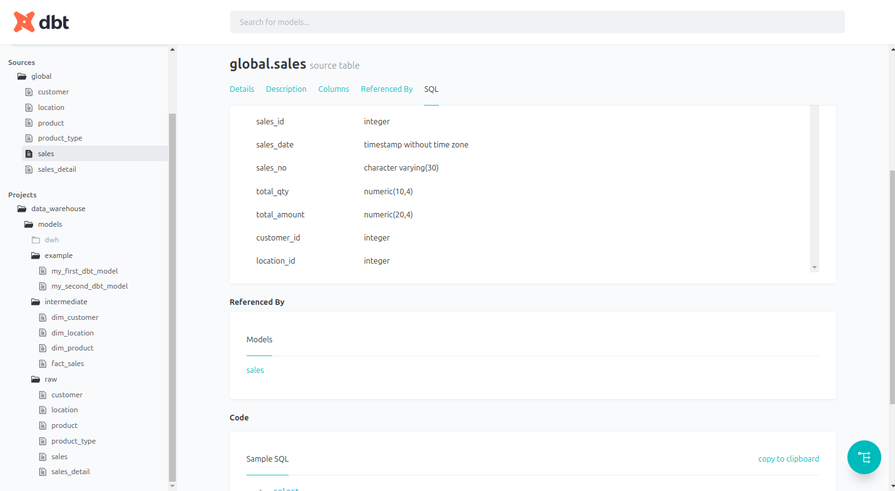
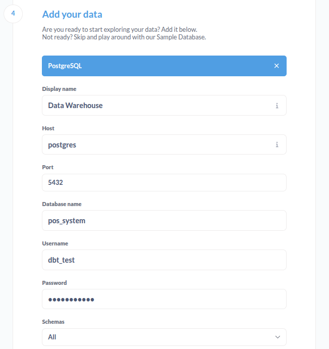

### A. Pre-Requirements:
1. **Postgres Image**
2. **DBT**
3. **(Optional) Metabase Image**

### B. Setup for PostgreSQL Container
1. Pull from **https://hub.docker.com/**, I'm using version 12

2. Run PostgreSQL Container (can customize based on your need)
`docker run --name postgres-dbt -e POSTGRES_USER=dbt_test -e POSTGRES_PASSWORD=dbt_12345## -e POSTGRES_DB=pos_system -p 1234:5432 -d postgres:12`

### C. Installing DBT
1. Create Python new virtual environemnt: `python3 -m venv dbt-env`
2. Activate Virtual Environment: `source dbt-env/bin/activate`
3. Install DBT libraries: 
    - `pip3 install dbt-core`
    - `pip3 install dbt-postgres`
    - check version to ensure dbt and postgres are installed: ` dbt --version`

### D. Setup Schema, Tables and Records in PostgreSQL container
1. Run PostgreSQL container as a bash:
`docker exec -it postgres-dbt bash`
2. Login into Database:
`psql -U dbt_test -d pos_system`
3. Create new table (**ddl.sql**), to ensure the tables are created:
`\dt global.*`
check schema tables:
`\d global.table_name`
4. Insert record using **dml.sql**
5. Create schema for DBT (Data Build Tool) using **dbt_schema.sql**.

### E. Setup DBT for Transformation
1. Initiate DBT project: `dbt init`

2. Copy **profiles.yml** and store into dbt project (data_warehouse).
3. Customize **data_warehouse/dbt_project.yml**, change line profile from data_warehouse into data_warehouse_profile. And also in **data_warehouse/profiles.yml**, in top line, change data_warehouse into data_warehouse_profile. It can be conflict if line name in **data_warehouse/dbt_project.yml** is same with the line profile.
4. Enter into DBT project path: data_warehouse then check connection dbt to postgres: `dbt debug`. Ensure all checks passed.

### F. Data Modelling (STAR Schema)
1. In data_warehouse/models/, create new driectory named raw, intermediate and dwh. 
    - `mkdir -p models/raw`
    - `mkdir -p models/intermediate`
    - `mkdir -p models/dwh`
2. Create the same table attributes like in global schema for each table into global_raw. Example: `touch models/raw/location.sql`
3. Create sources.yml in data_warehouse/models/
4. Create intermediate model and write it to global_intermediete schema using DBT. This contain fact and dim tables. Example: `touch models/intermediate/dim_location.sql`
5. Create dwh model and write it to global_dwh schema using DBT: `touch models/dwh/dashboard_revenue_category.sql`
6. Customize data_warehouse/dbt_project.yml

### G. Build DBT
- `dbt clean`
- `dbt run`
- `dbt docs generate`

**Display UI**
- `dbt docs serve`
To access from your browser, navigate to: http://localhost:8080

### (Optional) How to Display the output using Metabase
1. Pull metabase container: `docker pull metabase/metabase`
2. Run metabase container
    - `docker run -d -p 3000:3000 --name metabase --link postgres-dbt:postgres metabase/metabase`

3. Configure metabase to connect to ostgreSQL, open http://localhost:3000 in browser.

    - Database Type: PostgreSQL
    - Name: (Choose a name for your database connection, e.g., "Postgres DB")
    - Host: postgres (this is the alias for the PostgreSQL container since we used the --link option).
    - Port: 5432 (the default port for PostgreSQL inside the container).
    - Database Name: pos_system (your specified database).
    - Username: dbt_test (the username you specified).
    - Password: dbt_12345## (the password you specified).
4. Result.

### Lineage Graph

